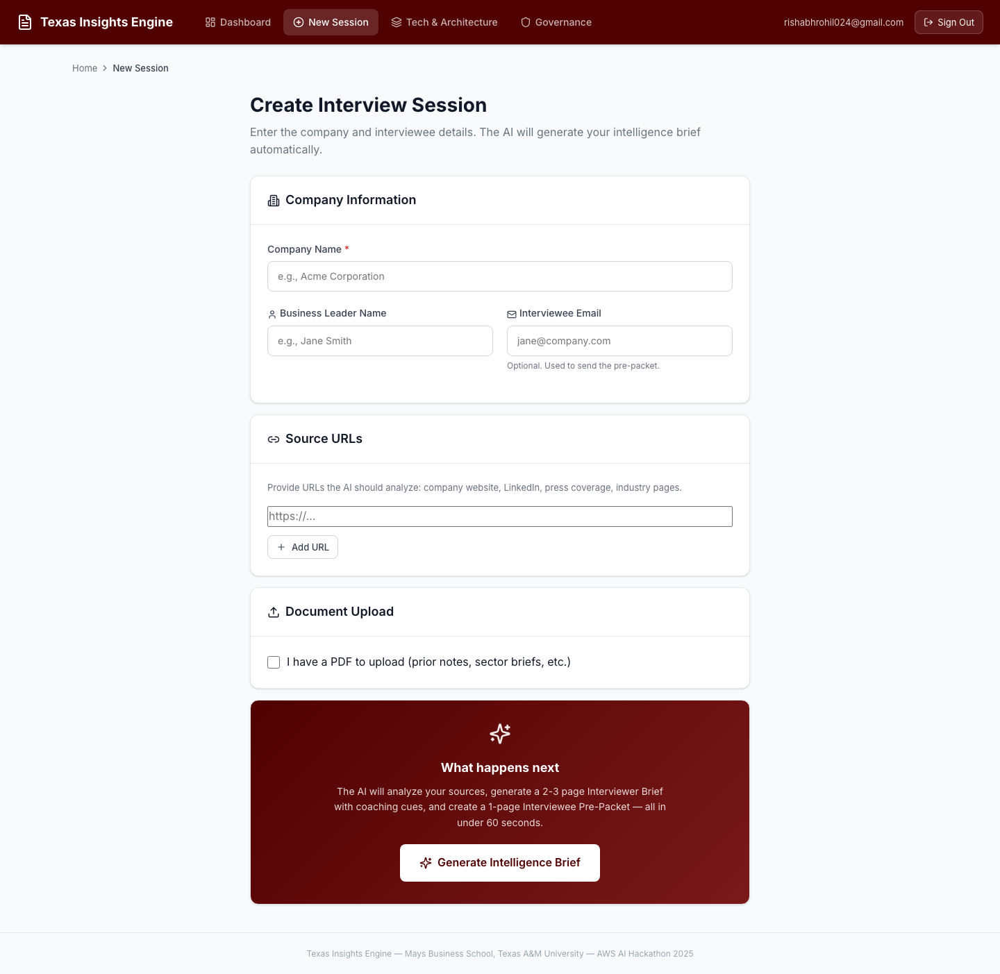
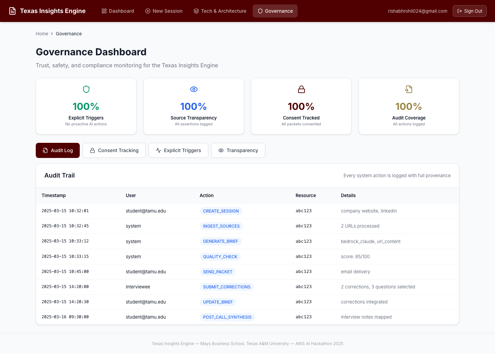
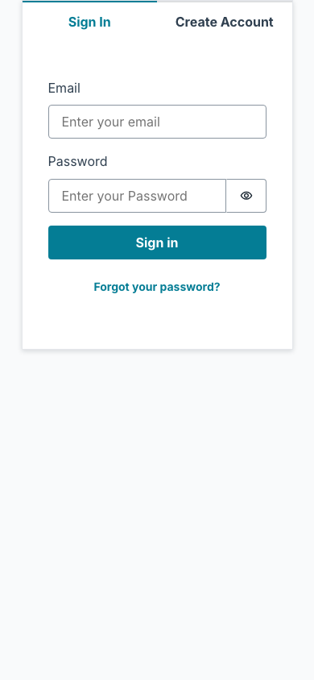
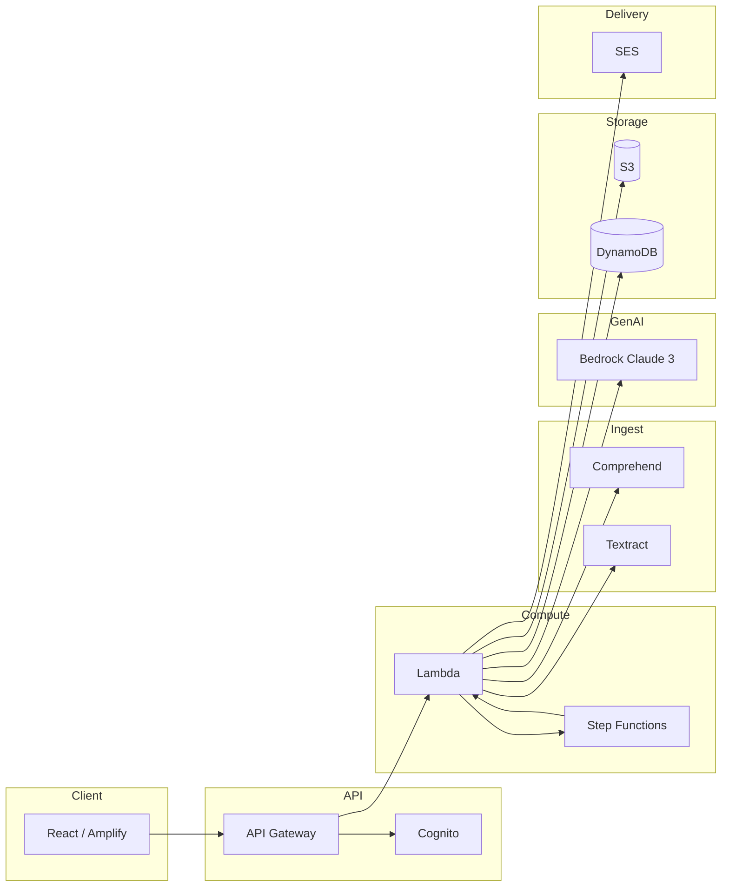
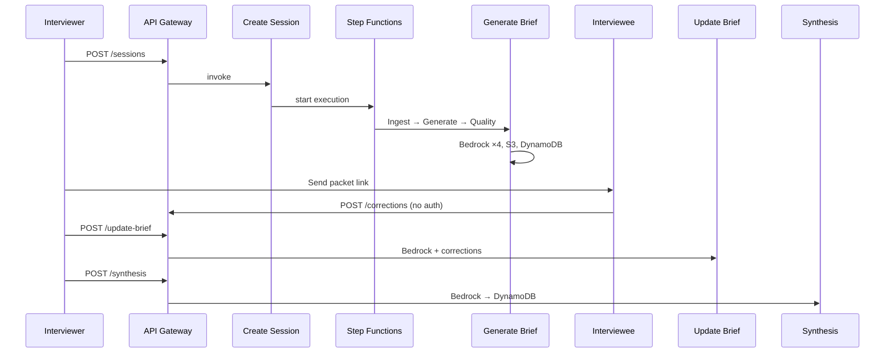
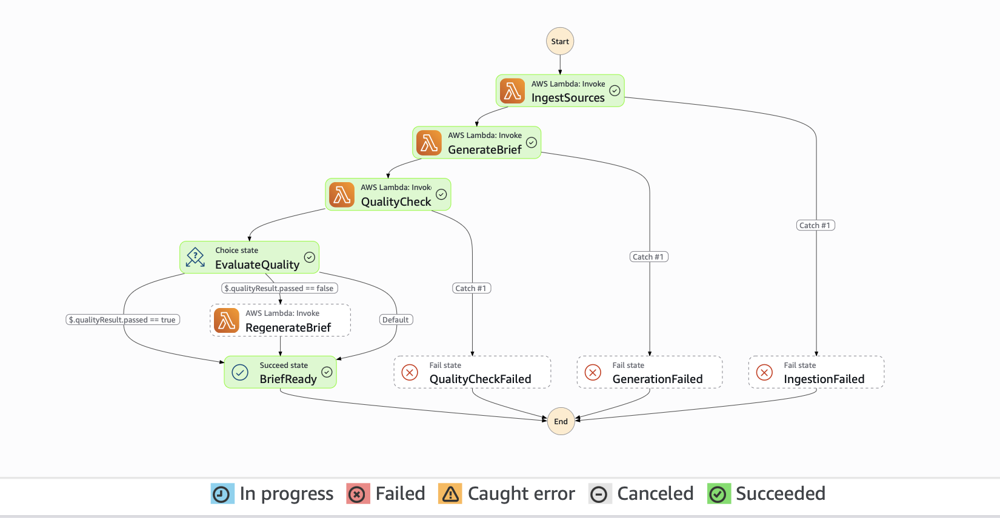
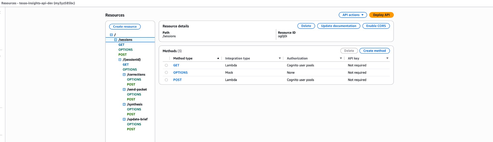
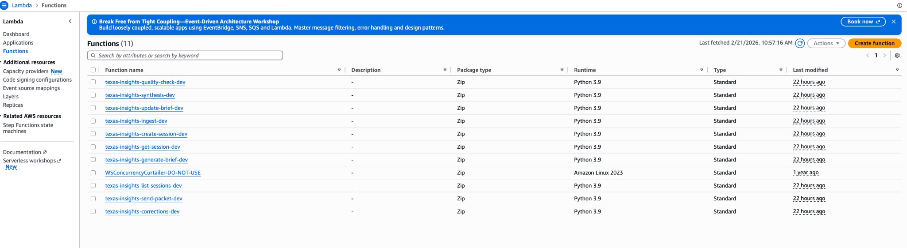

# Texas Insights Engine

**AI-powered interview intelligence: turn cold outreach into warm, insight-rich conversations.**

Mays Business School, Texas A&M University · AWS AI Hackathon 2025

---

## What It Does

- **Pre-interview:** You provide company name and URLs (and optional PDF). The system ingests content (Comprehend, Textract), then uses **Amazon Bedrock (Claude 3 Sonnet)** to generate a company profile, interviewer brief with coaching cues, and a one-page interviewee packet.
- **Interviewee feedback:** Interviewees review the packet, correct facts, and select 2–3 questions—no login required.
- **Update brief:** The brief is regenerated with corrections; versioned in S3.
- **Post-call:** Structured synthesis and insights are written to DynamoDB for the Texas Insights knowledge model.
- **Governance:** Explicit triggers only, full audit log, consent tracking, source transparency.

---

## Demo / Screenshots

### UI

| Dashboard | New Session | Tech & Architecture |
|-----------|-------------|----------------------|
|  |  |  |

| Governance | Dashboard (mobile) |
|------------|---------------------|
|  |  |

---

## Architecture Overview



High-level: **React (Amplify)** → **API Gateway + Cognito** → **Lambda** (create session, send packet, corrections, update brief, synthesis) and **Step Functions** (orchestrates ingest → generate brief → quality check). Ingest uses **Comprehend** and **Textract**; brief and synthesis use **Bedrock**; artifacts in **S3** and **DynamoDB**; optional email via **SES**.

---

## End-to-End Flow

1. **Interviewer** creates a session (company name, URLs, optional PDF) → **Create Session** Lambda writes DynamoDB, optionally S3 presigned URL, starts **Step Function**.
2. **Step Function:** **Ingest** (fetch URLs, Textract PDF, Comprehend entities/key phrases) → **Generate Brief** (Bedrock: profile, questions, interviewer brief, interviewee packet) → **Quality Check** (optional regenerate) → **Brief Ready** (S3 + DynamoDB).
3. **Interviewer** sends packet (link or SES email) → **Interviewee** opens feedback page (no auth), submits corrections and selected questions.
4. **Update Brief** Lambda loads corrections, calls Bedrock again → new brief version in S3.
5. **Post-call:** Interviewer submits notes → **Synthesis** Lambda (Bedrock) → S3 + DynamoDB insights.



---

## Tech Stack

| Layer | Technology |
|-------|------------|
| Frontend | React, AWS Amplify (hosting), Cognito (auth) |
| API | API Gateway (REST), Cognito authorizer |
| Compute | Lambda (10 functions), Step Functions |
| AI/ML | Amazon Bedrock (Claude 3 Sonnet), Comprehend, Textract |
| Data | DynamoDB (5 tables), S3, SES (optional) |
| IaC | AWS SAM |

---

## Setup (Local Run)

### Prerequisites

- Node.js 18+
- AWS CLI configured
- AWS SAM CLI
- Python 3.9+ (Lambda runtime)

### Backend

```bash
cd backend
sam build
sam deploy --guided
```

Note the API URL and Cognito User Pool/Client ID from the outputs.

### Frontend

```bash
cd frontend
cp .env.example .env
# Edit .env: REACT_APP_API_URL, REACT_APP_USER_POOL_ID, REACT_APP_USER_POOL_CLIENT_ID, REACT_APP_AWS_REGION
npm install
npm start
```

### Env template (no real values)

```env
REACT_APP_API_URL=https://YOUR-API-ID.execute-api.us-east-1.amazonaws.com/dev
REACT_APP_AWS_REGION=us-east-1
REACT_APP_USER_POOL_ID=us-east-1_XXXXXXXXX
REACT_APP_USER_POOL_CLIENT_ID=XXXXXXXXXXXXXXXXXXXXXXXXXX
```

---

## AWS Evidence

| Service | Screenshot |
|---------|------------|
| Bedrock (Claude 3 Sonnet) |  |
| Step Functions |  |
| API Gateway |  |
| Lambda |  |
| DynamoDB |  |
| S3 |  |

---

## Security & Privacy

- **Explicit triggers only** — no proactive AI; user actions only.
- **Consent** — opt-in and opt-out at every stage.
- **Audit** — every action logged with provenance.
- **Source transparency** — assertions tagged [Public], [Proprietary], or [Inferred].
- **Encryption** — S3 and DynamoDB encryption at rest; Cognito on protected endpoints.
- **Public endpoint** — only `POST /sessions/:id/corrections` is unauthenticated (interviewee feedback).

---

## Project Structure

```
├── backend/                 # SAM template, Lambda, Step Functions
│   ├── template.yaml
│   ├── statemachine/
│   ├── layers/shared/
│   └── functions/
├── frontend/                # React app (Amplify-ready)
│   └── src/
│       ├── pages/
│       ├── components/
│       └── services/
├── screenshots/
│   ├── ui/                  # App UI screenshots
│   ├── aws/                 # AWS console evidence
│   └── claude/              # Bedrock/Claude evidence
├── scripts/                 # Deploy, credentials helpers
└── README.md
```

---

## Credits

Texas A&M University — Mays Business School · AWS AI Hackathon 2025

